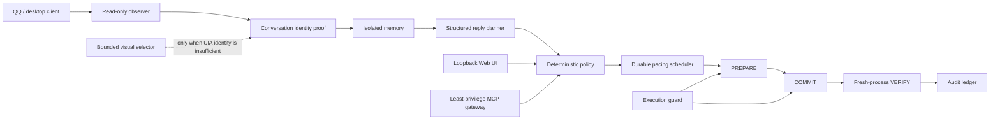

# Personal Messenger AI

> A local-first, fail-closed messaging-agent architecture for safe multi-conversation automation on Windows.

这是一个面向个人消息场景的工程原型。项目研究如何在不依赖私有协议、注入或内存读取的前提下，把消息观察、联系人隔离、长期记忆、结构化回复规划、确定性策略、节奏控制和可审计发送组合成一条安全流水线。

后续重构的统一设计入口是 [QQ 个人聊天助手：整体架构基线](docs/ARCHITECTURE-V1.md)（2026-10-01）。该文档定义目标范围、模块与数据所有权、部署、恢复、迁移及验收；它是待实施方案，不代表下述现有实现已经完成重构。

它的重点不是“让模型自动聊天”，而是解决一个更难的问题：**当视觉识别、桌面 UI、模型输出或进程状态不可靠时，系统如何证明自己可以安全继续；无法证明时，如何确定地停止。**

## Engineering highlights

- **Fail-closed execution**：身份、窗口、群聊类型、授权、时序或回执任一证据不足即停止。
- **Multi-conversation isolation**：联系人记忆、游标、计划、节奏和发送账本按会话隔离。
- **Exactly-once-oriented delivery**：`PREPARE → COMMIT → VERIFY`，不确定结果进入隔离状态，不盲目重发。
- **Bounded visual fallback**：视觉模型只判断经过认证的单行联系人区域，不读取完整聊天窗口，也不生成坐标或消息正文。
- **Process-generation verification**：动作进程退出后，由不同 PID/epoch 的新 worker 重新确认身份与结果。
- **Deterministic policy layer**：模型只生成结构化 `ReplyPlan`；是否允许发送由确定性规则决定。
- **Privacy by design**：本地 SQLite、Windows DPAPI、日志脱敏、证据 TTL 和最小化诊断输出。
- **Large regression surface**：覆盖并发、崩溃恢复、提示注入、错误联系人、群聊排除、重复发送与不确定提交等对抗场景。

## Architecture



## Why this project is difficult

| Problem | Engineering response |
|---|---|
| Desktop controls and coordinates drift | Certified environment profiles, geometry checks and post-action re-observation |
| A click does not prove the selected recipient | Independent identity proof from a fresh worker generation |
| Model output is nondeterministic | Strict schemas plus a deterministic policy and authorization layer |
| A timeout may mean “sent” or “not sent” | Durable `UNCERTAIN` state; never automatic retry |
| Multiple conversations can contaminate context | Per-contact memory, cursors, pacing and operation IDs |
| Logs can leak private chat content | Redaction, allow-listed metrics, hashed evidence and bounded diagnostics |

## Project status

The repository contains the complete local architecture, multi-contact runtime, visual-selection boundary, one-shot delivery flow, Web UI/MCP control surfaces, security controls and an extensive automated test suite.

- Offline and synthetic verification is implemented.
- A supervised direct-message path has been exercised in a controlled test environment.
- Persistent unattended sending remains disabled until additional live soak and compatibility gates are completed.
- Group chats are explicitly outside the current automatic-send scope.
- No real account identifiers, chat transcripts, API keys, screenshots, databases or VM runtime artifacts are included in this repository.

See [implementation status](docs/IMPLEMENTATION_STATUS.md), [acceptance matrix](docs/acceptance-matrix.md), [threat model](docs/threat-model.md), and [privacy model](docs/privacy-model.md).

## Evolution trail

This is a cumulative engineering project, not a one-shot generated demo. The repository intentionally preserves its real milestone history: sanitized baseline, multi-contact foundation, durable VM/runtime controls, offline acceptance, and the completed V5 runtime. The publication commit records the later working-tree progress and public-release cleanup; it does not imply that the system was built in that single commit.

The architecture grew in layers—from fail-closed domain contracts and adapters, through isolated memory and deterministic policy, to durable pacing, multi-contact orchestration, visual selection and fresh-process delivery verification. Existing verification failures are recorded rather than silently repaired or hidden for presentation.

See [Engineering journey](docs/ENGINEERING-JOURNEY.md) for the milestone narrative and preserved verification baseline.

## Repository map

```text
src/messenger_ai/
  adapters/          QQ/WeChat observation and execution boundaries
  domain/            core entities, events and invariants
  execution_guard/   cancellation, capability and commit guards
  hub/               durable command/event coordination
  llm/               structured planning and provider adapters
  memory/            per-contact memory and provenance
  pacing/            durable scheduling and segmentation
  policy/            deterministic eligibility and authorization
  runtime/           orchestration, recovery and settlement
  webui/             loopback-only operator interface
  observability/     redaction, incidents, metrics and secrets

tests/                unit, integration, concurrency and adversarial tests
scripts/              local tools, acceptance checks and VM deployment
fixtures/             synthetic evaluation and compatibility fixtures
profiles/             non-secret certified environment examples
rulepacks/            customizable policy/persona examples
docs/                 architecture, security and acceptance evidence
```

## Quick start

Requirements: Python 3.12+.

```powershell
py -3.12 -m venv .venv
.\.venv\Scripts\Activate.ps1
python -m pip install -e ".[test,web,mcp,llm]"
python -m pytest -q
```

Start the loopback-only workbench in demo mode:

```powershell
python scripts/run_local_webui.py
# http://127.0.0.1:8765/inbox
```

Run key offline checks:

```powershell
python scripts/system_acceptance.py
python scripts/run_llm_evals.py --json
python scripts/policy_matrix.py
python scripts/pacing_audit.py
python -m compileall -q src scripts
```

The VM and live QQ scripts are intentionally guarded and are not part of the quick-start path.

## Safety boundaries

This project deliberately avoids:

- private QQ/WeChat protocols;
- process injection, hooks or memory scraping;
- CAPTCHA or platform-protection bypasses;
- unrestricted desktop control;
- silent retries after an uncertain send;
- binding a recipient from a display name alone;
- storing credentials or chat content in the repository.

The example RulePack remains a draft until explicitly activated in a controlled environment. A logged-in desktop client is not treated as proof that observation or sending is safe.

## Verification philosophy

Tests distinguish four different claims:

1. code exists;
2. offline contracts pass;
3. a capability works in a certified desktop environment;
4. unattended operation is safe over time.

Passing one level never silently upgrades the next. This separation is central to the project and prevents a successful demo from being misrepresented as production readiness.

## Author

Built and maintained by [liuxueqi0044](https://github.com/liuxueqi0044) as a systems-engineering portfolio project.
