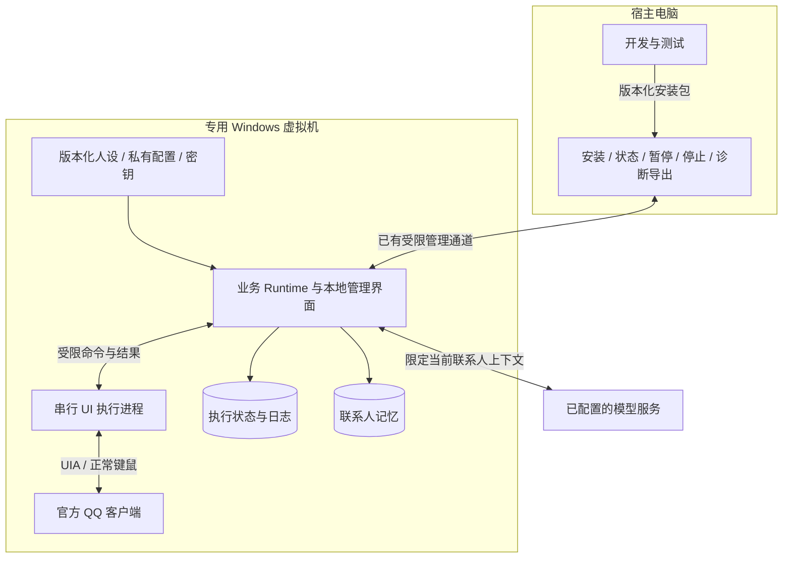
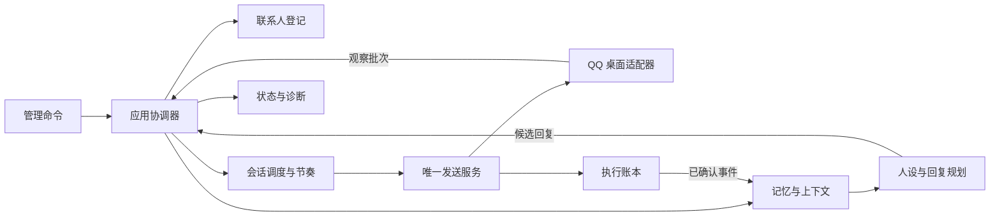
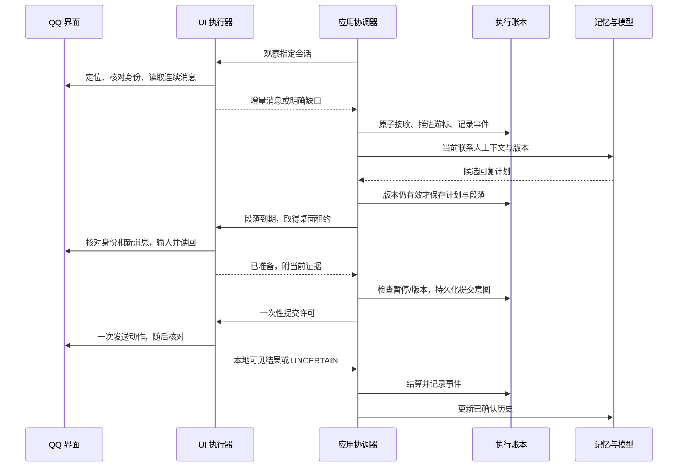
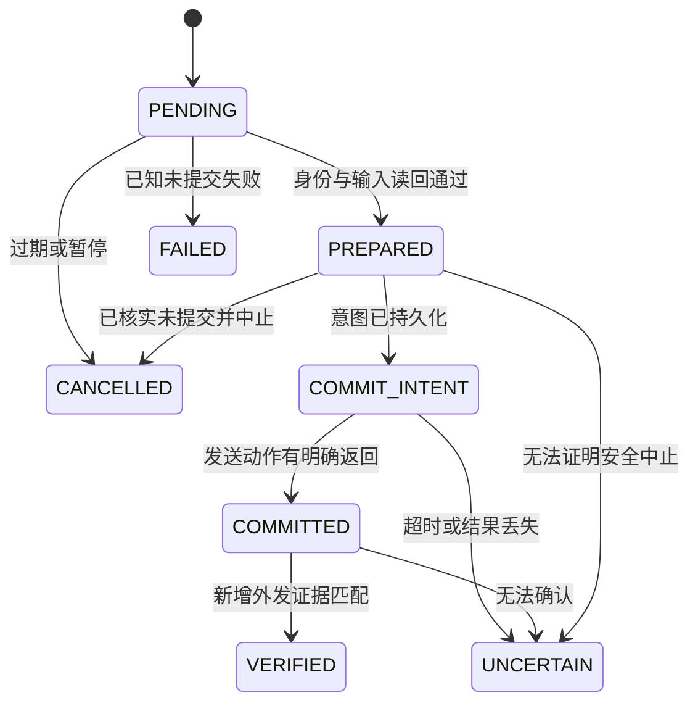

# QQ 个人聊天助手：整体架构基线

日期：2026-10-01。审查代码：`08d53ebde9fe031dbc21f6e3b715efa6effb7b71`。

**状态：待实施的目标架构。本文不表示代码已经重构，也不表示实机已经通过验收。** 本轮只编写架构文档；客户端、虚拟机和自动回复保持原有暂停状态。

## 1. 项目到底要交付什么

交付一个在专用 Windows 虚拟机中运行的个人 QQ 聊天助手：通过官方 QQ 客户端的界面读取消息，按联系人分别维护上下文和记忆，使用指定人设生成自然回复，并通过界面发回正确联系人。用户能够看懂它正在做什么、为何暂停，并能够接管、停止和恢复。

成功标准同时包含**可用性、聊天效果、身份正确、可恢复、可维护**。只会停止、从未稳定完成收发的系统不算交付；一次演示成功也不算无人值守稳定。

### V1 范围

| 保留为首版核心 | 暂不扩展 |
|---|---|
| 一个官方 QQ 账号、一个专用 VM、多个独立一对一会话 | 多账号集群、跨机器执行、微信适配 |
| 文本及文本内 Unicode/表情字符，原人设支持的 0–3 段回复 | 图片/语音/文件的自动理解与发送 |
| 联系人分别启停、连续消息合并、独立记忆、人工接管 | 自动加好友、群聊自动回复、批量主动群发 |
| 故障说明、发送记录、暂停/恢复、可重复安装与升级 | 云端控制平台、插件市场、通用电脑操作 Agent |

临时一对一会话保留现有产品配置的表达能力，但其身份识别必须通过同样的验证；不因为标题看起来像人名就按好友处理。未支持的消息类型要明确标识，不能假装已读懂。新增测试联系人仍须来自用户确认的测试范围，目前已明确的是“妈妈”。

### 已确定的技术边界

- 仅使用官方 QQ 客户端的正常界面：Windows UIA、正常键鼠、必要的局部截图。
- 不采用 QQ 私有协议、Hook、注入、内存/客户端数据库读取、客户端插件或调试协议控制。
- 人设原件、账号标识、聊天正文、密钥和运行数据库不进入公开仓库。
- 保持用户已确定的内容规则开关设置；本次不重新启用内容拦截。联系人核验、暂停、去重和发送结果核对独立于内容规则。
- 多联系人是业务并发；一个桌面的键盘、鼠标和当前聊天只有一个执行者。

## 2. 架构结论及原因

采用**模块化单体：一个业务 Runtime，加一个受控的 UI 执行子进程**。功能模块在同一程序内通过明确接口协作，不拆成微服务，不引入 Redis、Kafka 或第二套机器人框架。

保留人设、模型接口、联系人记忆、分段节奏、修订版本、暂停机制及发送账本的业务能力。集中收敛数据所有权、业务调度、QQ 驱动、恢复和部署。上层保留不意味着原代码不需要改动；所有权和接口变化会逐步触及 Hub、Pacing、Runtime 等模块。

现有问题不能简单归结为“没有架构”。仓库已有较完整的分层与契约；主要失衡是：最脆弱的实际 UI 能力尚未稳定，上层先形成了多套持久状态和恢复路径，部分试验入口又与正式入口不同。

| 当前事实 | 架构决定 |
|---|---|
| Runtime 已有轮询、模型并发和锁 | 继续使用；把桌面访问汇入一个有期限、可诊断的队列 |
| Hub、Runtime、Pacing、Bridge 分别记录发送进度 | 指定唯一最终状态负责人，其他记录是证据或投影 |
| 正常 QQ VM 主链有 8 个 SQLite 文件 | 库数本身不是缺陷；先明确事务边界，再渐进减少执行链跨库更新 |
| 联系人定位与 UI 临时标识绑定很紧 | 稳定联系人身份与可失效的 UI 定位分开 |
| 切换聊天可能引发工作进程换代 | 用对照实验决定是否必要，不把正常导航固定成复杂恢复 |
| 单条测试与正式多段流程有过不一致 | 测试、手工调试、守护运行复用同一条应用发送路径 |

## 3. 运行部署图

- Runtime、WebUI 和持久数据驻留 VM；QQ UI worker 为受监管的子进程。不是 Windows 非交互 Session 0 中的桌面服务。
- 宿主只管理和诊断，不承担逐条聊天时的键鼠操作；不把活跃 SQLite 放在宿主共享目录运行。
- 模型服务失败不破坏观察、暂停和本地数据。模型网络请求有期限、并发和成本边界。
- 开发助手、Dot、MCP 不属于无人值守运行的必需部件。MCP 当前接线与正式运行未统一，V1 不依赖它。
- 保留已有单实例互斥；每个桌面最多一个 Runtime 拥有执行权。旧、新驱动不能同时写 QQ。
- 工作进程重启不等于 QQ 重启；QQ 重启不等于业务账号或联系人重新创建。

## 4. 逻辑模块与所有权

图中方框是模块，不是独立网络服务。只有 QQ 适配器的 UI worker 需要进程隔离。

| 模块 | 输入与输出 | 唯一职责 | 不能做什么 |
|---|---|---|---|
| 应用协调器 | 观察、管理命令、生成结果 → 状态变更与任务 | 串起业务生命周期，提交事务，处理版本变化 | 直接调用 UIA 或自己拼另一条发送流程 |
| 联系人登记 | 身份证据 → 稳定联系人与绑定版本 | 账号、联系人、会话、临时绑定的对应关系 | 仅凭昵称/头像/行位置永久认人 |
| 观察与归一化 | 当前 UI 快照+游标 → 增量消息/缺口 | 完整性、方向、重复文本、有序对齐 | 把截图猜测当成平台消息 ID |
| 记忆与上下文 | 已确认事件+人工编辑 → 当前联系人上下文 | 历史、摘要、事实、偏好及来源 | 跨联系人检索私人上下文，记录未发送草稿为事实 |
| 人设与规划 | 人设版本+上下文+入站修订 → ReplyPlan | 生成 0–3 段候选内容及解释性元数据 | 选择窗口、点击、发消息、改运行权限 |
| 调度与节奏 | 入站事件/ReplyPlan → 到期任务 | 同会话顺序、合并、过期、有限并发、公平等待 | 长时间占用桌面等待模型或分段计时 |
| 执行资格与控制 | 最新版本/暂停/绑定/任务 → 提交资格 | 检查当前操作是否仍被允许 | 将聊天正文当作管理指令 |
| 发送服务与账本 | 到期任务 → 准备/提交/核对/未知结果 | 唯一发送生命周期和最终状态 | 超时后盲目重按发送 |
| QQ 桌面适配器 | 受限命令 → 快照、局部动作与证据 | 窗口、控件、焦点、资料页、消息区、输入框 | 调用模型，维护另一套人设/业务规则 |
| 运维与诊断 | 状态/事件 → 面板、故障包、安装包 | 可重复部署、升级、备份、明确故障 | 从管理面绕过发送服务直接向 QQ 输入 |

“执行资格”由程序根据既有配置计算，不表示每条消息都要求用户确认。需要人工处理的情况限于身份歧义、无法核实的发送结果或明确接管等实际状态。

### 依赖约束

1. Domain 只含数据结构、纯规则和状态转换，不依赖 UIA、WebUI、数据库实现或模型 SDK。
2. 应用层依赖端口；Windows、SQLite、模型服务、文件等具体实现位于适配层。
3. WebUI、CLI、文件控制和未来 MCP 都调用同一组应用命令，不能分别修改账本或开辟发送入口。
4. 业务层不携带 HWND、COM 控件或像素坐标；临时 UI 对象不得跨线程、跨进程或跨会话长期缓存。
5. 正式运行和验收使用同一个应用装配入口；演示数据与真实运行必须显式区分。

## 5. 数据模型：哪些东西稳定，哪些会过期

| 标识/版本 | 生命周期 | 用途 |
|---|---|---|
| account_id | 持久 | 区分机器人账号 |
| contact_id | 持久 | 联系人记忆与配置，不随改名/重启改变 |
| conversation_id | 持久 | 账号下的具体会话；所有查询带账号和会话范围 |
| binding_revision | 核验绑定变化时增加 | 防止旧定位或旧身份计划继续执行 |
| conversation_revision | 新入站、人工外发或接管等改变规划依据时增加 | 拒绝过期模型结果和待发段落；本计划已确认外发不自行使余段过期 |
| context_revision | 人工事实/偏好/摘要等上下文内容改变时增加 | 即使消息未变，也拒绝依据旧记忆生成的结果 |
| persona_id + rulepack_version | 会话绑定的不可变人设/设置内容 | 默认可共享模板，生成与发送固定所用版本 |
| control_revision | 全局/联系人控制变化时增加 | 暂停、接管、恢复前的再次核验 |
| operation_id + segment_ref | 一次逻辑发送内稳定 | 防止同一段被重复提交 |
| session_epoch / worker_epoch | QQ 会话 / UI worker 生命周期 | 使过期执行令牌失效 |
| HWND / RuntimeId / 控件位置 | 当前界面内临时 | 定位候选，不能作为永久联系人身份 |

联系人优先通过正常资料界面中可见的唯一标识绑定；是否可由 UIA 稳定读取仍需实测。身份标识可私有保存或使用 HMAC，公开诊断只含摘要。头像、标题和备注仅为辅助。

若资料页读取与返回不可靠，允许明确的“本次 QQ 会话内绑定”模式，UI 会显示其有效范围；窗口重建后停止该联系人的发送并重新确认。不能为了自动恢复把同名者的记忆合并。

当前代码以全局人设主体加联系人语气/节奏等覆盖为主，不能宣称已实现每个联系人独立完整人格。V1 保留原人设与分别发展的关系、记忆；人设绑定端口预留多个不可变模板的表达能力，不在本轮扩建人格编辑器或复制多套 Runtime。

目标模型显式保存会话的人设绑定：persona_id、rulepack_version、contact_override_revision。初始可全部指向原来的同一份不可变人设；共享模板不共享记忆、关系或可变状态。全局模板变更影响使用它的会话，联系人覆盖变更只使对应会话计划失效。

### 记忆维护的完整闭环

现有代码有历史消息、摘要、事实、偏好和关系的存取接口，但自动摘要/事实维护尚未全面接入正式运行。目标架构增加同进程内的有界维护任务，不另建服务：已确认事件 → 当前联系人摘要候选 → 核验来源范围和上下文版本 → 保存新版本。

每条摘要或推断保存来源消息范围、生成版本和时间；模型推断与用户明确提供的事实分开，不能覆盖人工事实，也不能把聊天内容中的指令升级成运行设置。维护失败时继续使用最后有效摘要与预算内近期消息，不阻塞收发、不静默跨联系人检索。人工更改记忆时增加 context_revision，并使受影响的尚未提交计划失效。

规划指纹必须包含上下文内容版本，不能只包含 source IDs。验收包含消息未变但偏好被修改、摘要结果过期、上下文超过预算和维护模型失败。

## 6. 持久化与事务边界

### 目标状态

**执行链只有一个权威账本。** 目标将联系人登记、控制版本、入站事实/游标、计划与段落、提交资格、提交意图和发送结果放在一个执行 SQLite 的统一事务接口下。可以沿用 `runtime.sqlite3`，不要求新建第九个正式业务库。

| 数据 | 权威负责人 | 其他模块如何使用 |
|---|---|---|
| 联系人、会话绑定、运行控制 | 应用层 Registry / Control | 驱动读取短期租约，WebUI 读取投影 |
| 已接收消息、游标、业务事件 | Observation Repository | 记忆和规划按事件 ID 幂等消费 |
| 计划、段落、到期时间 | Scheduling Repository | 模型不直接写，UI 不自行排程 |
| operation、准备证据、commit-intent、receipt、执行结果 | ExecutionJournal | 驱动提交证据；Hub/界面不得另行决定终态 |
| 历史摘要、事实、人工偏好 | Memory Repository，可独立库 | 从已确认事件构建；人工记录保留来源，不作为可丢弃缓存 |
| 人设原件、编译产物 | 不可变版本库 | 执行库中的会话人设绑定和 active 配置快照决定生效范围 |
| 日志、截图、指标 | Diagnostics，有限保留 | 不参与发送真假判定，也不能代替账本 |

聊天历史投影可以按已有源事件重建，但被清理掉的原始数据、人工编辑的记忆不能凭空重建。备份和保留策略必须覆盖它们。

准备阶段的验证证据、receipt 指纹和 operation/segment 关联属于持久执行事实，不属于随日志 TTL 清理的诊断。它们保留到相关操作与恢复期限允许归档之后；不能因清理截图而失去核对依据。

### 四个必要的本地原子操作

1. **接收**：保存消息与去重键、推进已确认游标、记录业务事件，属于同一事务；提交后才确认观察批次。崩溃后允许批次重放，但事件不能重复生效。
2. **接受计划**：检查联系人/消息/人设/控制版本，在同一事务保存计划和待发段落；旧版本结果明确作废。
3. **提交意图**：检查资格、消费一次性许可、绑定已持久化准备证据、写入 operation 的提交意图并登记在途操作后，才准许 UI 执行发送。数据库事务不能跨网络或 UI 等待长期持锁。
4. **结算**：原子保存 receipt、结果和对应段落状态，并写出后续事件。记忆、界面等投影失败可以幂等重放，不能再次触发发送。

QQ 的外部点击不可能与本地 SQLite 组成真正原子事务。若已记录意图、却没有可靠结果，进入 UNCERTAIN，而不是回到待发。目标是清楚区分结果和避免盲目重复，不承诺绝对 exactly-once。

### 渐进迁移

当前有 runtime、hub、memory、pacing、rules、authorization、bridge 和 cursor 共 8 个正式文件；one-shot 工具还有独立尝试账本。已有跨库核对/重放机制应保留到迁移完成，不能因“单一权威”设计就直接删库。

先抽出 ExecutionJournal / ObservationRepository / SchedulingRepository 端口，默认仍连接旧存储。尤其保留 bridge 在实际 COMMIT 前持久化 commit-intent 的能力。之后在停机快照上迁移一类事实、核对 ID/数量/状态/未结算操作，再切换唯一写入者；旧库只读归档。回退代码不能恢复旧账本后重发已发送消息。

实际合库优先级：Runtime+Pacing 的计划/artifact/due → 一次性授权消费+Hub operation → Bridge 的执行证据与 cursor。Memory 和不可变规则内容无需为了合库而搬迁。迁移每一步都只有一个写入权威，并保留原状态到新状态的可核验映射。

| 迁移阶段 | 权威及冲突处理 |
|---|---|
| W0–W3，仍使用旧库 | 原 Runtime/Due 负责汇总，Hub operation、Bridge 执行事实和 Pacing receipt 保留各自职责。LegacyExecutionJournal 适配层封装现有核对路径；任一提交意图或矛盾证据都阻止自动重试，不能任挑一库覆盖其他库 |
| W4.1，合并计划事务 | 新执行库负责 plan/artifact/due；发送记录仍走上述旧核对路径，不创建新的发送终态写入者 |
| W4.2，迁移授权与 Hub operation | 新 ExecutionJournal 成为 operation 终态唯一写入者；Bridge 仍保留提交前日志并提供证据，不能独立修改应用终态 |
| W4.3，迁移 Bridge/cursor | 执行证据与观察事务通过同库端口写入；旧库只读归档，取消临时跨库核对实现 |

迁移元数据至少包含 schema_version、migration_id、journal_owner 和数据检查点。每次切换须在维护锁下确认旧写入者停止、比较稳定 ID/数量/状态及未结算记录，再发布新 owner。程序只允许在其声明兼容的数据版本上发送；不兼容时只读诊断。回退必须选择能理解当前账本的 release，不能只回退程序或回滚数据快照。

现有跨库恢复并非空白：入站 outbox 幂等投递、游标重放、已验证发送补结算及 commit-intent 防重发均已有实现。待重点验证的窗口包括“计划已排程但 artifact 尚未写入时崩溃”和“due 重放时重新授权与旧 draft 状态冲突”。这些来自静态源码分析，尚未在本轮故障注入，不能描述为用户现场已发生。

规则激活已有失效 outbox，但正式装配未接 invalidation_port；现有规则版本复查仍能拦住旧计划。目标接线需要补齐即时失效和状态清理，不能声称现状必然发出旧规则回复。

第一阶段先修已确认的恢复半更新和缺少日志，再做驱动能力验证；不把搬完所有数据库作为开始实机验证的前提。

## 7. 一条消息的完整流程

- 生成时记录输入消息范围和版本；生成期间来了新消息，旧结果要重新评估或作废。
- 发送前再次观察目标聊天，能避免已知的新消息被旧回复覆盖；无法保证消除最后检查之后才到达的外部消息竞争，发现后按后续消息处理。
- 模型看到已确认聊天和有来源的记忆，未发送草稿单独标识；不能把规划过但未发出的文本放进“已经说过”的历史。
- 人设版本切换使旧待发计划失效，历史发送记录保留原版本。
- UIA/未读/通知事件只用于提醒尽快观察，周期轮询兜底。只读最后一句不足以支持连续多消息。

机器人外发事实以 operation_id + segment_ref 去重。结算事件可以先写历史投影，后续 UI 回声只补充观察 key/证据，不再插入第二条历史；匹配不唯一则先待核对。人工在 QQ 或手机上的外发另记为外部事件，并按接管/上下文变化处理。

同计划第 1 段的已确认外发只推进该计划进度，不自动废弃第 2、3 段；新入站、人工外发或人设/人工记忆变化则可取消余段。自动摘要默认在该会话没有活动回复计划时发布，发布前重新检查来源版本，避免自己的后台维护反复取消余段；人工更改事实/偏好仍立即失效受影响计划。

## 8. 多联系人调度与桌面独占

保留当前有限模型并发，初始沿用 2 个生成任务。这个数是可调配置，不是吞吐承诺。

每个联系人有独立的入站序列、记忆、合并窗口、计划版本、分段状态和暂停状态。执行器只有一个 UI 队列：同会话保持顺序，不同会话按到期时间、最长等待时间和公平轮转选择。

桌面租约覆盖“准备输入 → 提交 → 结果核对/明确中止”；其他观察任务也不能在这期间切走聊天。生成等待、分段等待不占租约。不同段落之间可服务其他联系人，回来后必须重新核验。

UI 请求、模型任务和未处理消息都设上限。超量时保留已持久接收的数据、合并尚未生成的上下文或推迟计划，并显示积压；不能无限创建线程或静默丢弃消息。历史内容超出上下文预算时使用有来源的摘要。

一个联系人的身份歧义暂停该联系人；登录失效、模态弹窗或桌面不可用则暂停整个 UI 通道。多联系人容量取决于实测访问耗时、消息峰值和补读需求，不能承诺任意人数实时回复。

## 9. 状态机与停止语义

### 运行状态

`STOPPED → STARTING → PAUSED/READY`；运行中可进入 `PAUSING → PAUSED`、`DEGRADED` 或 `STOPPING → STOPPED`。

恢复启动时保留之前的暂停状态。本次用户要求关机保存的暂停不会因换架构、重启或重装自动解除。

### 会话状态

会话使用几个正交字段，而非把所有含义挤进一个状态枚举：binding_status（未绑定/绑定中/有效/需重绑）、observation_status（连续/有缺口）、delivery_status（正常/结果待核对），以及独立的 user_paused、暂停原因与 control_revision。

有效运行条件由这些字段和全局控制共同计算。自动补读或重新绑定只能改善对应健康字段，不能清除用户暂停。恢复依据必须明确，不通过不断重建联系人来清空错误。

### 发送状态

COMMIT_INTENT 是明确的持久阶段，可由现有 commit_intent 字段表达，不要求立刻新增公开枚举。现有状态机和调用点对取消语义必须一起收敛，不允许服务绕过状态转换自行改 status。

VERIFIED 仅指已按约定观察到本地外发证据，不等于对方已收到或已读。实机验收另记测试联系人确认。UNCERTAIN 对自动重试是终止状态；人工核对另写审计结论，不删除原操作后重做。

UNCERTAIN 会把该会话的 delivery_status 标为待核对，取消本计划尚未提交的余段，并阻止该会话新的自动发送，避免通过“新计划”间接重发未知内容。只读观察可以继续，其他联系人照常调度。核对结论和解除阻塞通过受限的审计命令记录；旧 operation 不重置回 PENDING，用户暂停也不会因此解除。

暂停先安装阻止新提交的控制栅栏，再等待在途动作结算；“已受理暂停”与“已完全暂停”在界面上分开。已经越过发送边界的动作不能被撤销承诺掩盖。真正进入 PAUSED/STOPPED 前，必须确认执行器已停或不再持有可执行许可；确认不了就报告等待/未知。

提交许可的签发与持久意图构成本地的提交起点；签发前可拒绝，签发后须将本操作视为在途。请求暂停与此起点由同一 ControlService/执行事务排序。不能只更新一张 paused 表就向用户报告桌面已停止。

已有 file-control 实现了 fence 和排空后确认，而 WebUI 当前有直接更新状态再返回 accepted 的路径。本次统一的是所有入口的语义，保留已有可靠机制，不再做另一套暂停实现。命令携带 request_id、run_id 和 expected_revision，重复请求返回已知结果；针对旧 run_id 的请求不得作用于新进程。

## 10. QQ 驱动子架构

| 子模块 | 责任 | 关键验收 |
|---|---|---|
| DesktopSession | 固定环境、前台、窗口生命周期、UIA 所属线程 | 最大化/DPI/遮挡/登录页/弹窗的状态真实可见 |
| IdentityResolver | 稳定身份与短期绑定 | 同名、改备注、重启不串人 |
| Navigation | 重新定位候选、一次切换、重新取控件 | 行重排、虚拟化、旧控件失效可解释 |
| ChatReader | 连续消息、方向、游标与有限补读 | 相同文本不误去重，缺口不伪装完整 |
| Composer | 空框检查、输入、读回、单次提交 | 不覆盖用户草稿、不在焦点漂移时继续打字 |
| ReceiptObserver | 读取新增外发证据和失败状态 | 超时不盲发，已发送不重复 |

优先整合现有 live_driver 的环境、资料身份、语义拓扑与 vm_driver 的执行能力，不建立第三套 QQ 业务适配器。内部可重组目录，但外部契约先保持兼容。

默认固定 QQ 最大化、分辨率、DPI、主题和面板宽度；UIA 读取为主，必要时做目标局部视觉确认。无关列表行的像素不应永久成为所有发送的共同前提。减少证据依赖需通过错误联系人和群聊负例，不能直接放宽阈值。

Python uiautomation 先保留。独立聊天窗口、FlaUI/UIA3、资料页唯一标识和减少进程换代都属于可验证的备选，不是已证实解决方案。对照实验成功前不迁移语言、不删新进程核对边界。

### 外部端口需要收敛的契约

| 端口方法 | 结果与语义 |
|---|---|
| health / resolve_binding | 能力、会话版本、可用/歧义/失效原因 |
| observe_conversation | 带账号/会话/版本的 ObservationBatch，含完整性与缺口 |
| acknowledge_observation | 仅在应用已持久接收后确认，允许幂等重复 |
| prepare_send | 带 operation、段落和版本的准备结果及限时 UI 租约 |
| commit_send | 一次性提交许可；超时不能被解释为未发 |
| verify_send | 匹配操作的证据或未知状态，不隐含重发 |
| abort_send | 仅在可核实未提交时清理本操作草稿，返回真实结果 |
| close / status_snapshot | 确认执行器关闭、导出有限诊断 |

现有 V5MessengerDriver Protocol 仅完整声明了部分发送方法，实际调用还依赖观察、确认和中止能力。实施时补齐契约和适配层，不能只增加更多 getattr 分支。UI 控件不出此边界。

## 11. 故障、恢复与可观测性

| 故障 | 动作 | 不允许的动作 |
|---|---|---|
| 控件失效，尚未输入 | 重新获取并重新核对，有限次重试 | 继续使用旧坐标 |
| 焦点变化/用户草稿 | 停止本操作，保留草稿；核实后再处理 | 清空不属于机器人的输入 |
| 联系人身份不明 | 暂停该会话，重新绑定 | 按昵称接续记忆 |
| 消息序列缺口 | 有限补读，仍不连续则待核对 | 把整屏旧消息都当新消息 |
| 模型超时 | 有界重试/延后，重新检查上下文版本 | 让模型失败触发 QQ 重启 |
| UI worker 卡死 | 先判断是否可能提交，终止并确认退出，再重建 | 两个 worker 同时抢桌面 |
| 提交后结果未知 | 隔离 operation，观察核对 | 直接重新点击发送 |
| 磁盘写入失败 | 不发出新的提交许可，报告持久化失败 | 内存中假装已落盘 |
| QQ 重启/重新登录 | 更新 UI 会话版本，重新绑定和核对未结算发送 | 清空游标或换业务 ID 来绕过 |
| 配置发布失败 | 保留上一完整版本 | 登记、manifest、配置各成功一部分 |

每次请求记录 request_id、匿名联系人标识、操作阶段、原因码、耗时、release、绑定/会话版本和结果；首次失败、最后成功独立保留。无控制台启动仍写同样的结构化文件日志。

管理界面至少显示：运行/暂停状态、每联系人最后观察时间、积压和待发段落、身份失效、UNCERTAIN 操作、具体失败阶段。不得把“worker 活着”显示成“收发正常”。

## 12. 配置、密钥、发布和备份

四类版本独立：程序 release、QQ 环境档案、人设版本、业务绑定修订。临时 worker epoch 不进入人设内容版本，也不迫使记忆迁移。

统一入口提供 check、start、status、pause、resume、stop、diagnostics。它们是同一个程序的命令，不必各自开发新服务。保留已有命名互斥、文件控制和 graceful_stop 能力，把任务目录中的通用修复收回仓库；私人路径和凭据继续放私有配置。

发布采用不可变 release 目录+单一活动指针。先完整生成、校验候选，运行 --check，再切换；失败保留旧活动版本。运行环境日志记录实际 release，不能脚本写 r03、安装却是 r07。

保留当前 supervisor 的进程存活、run_id 和退出检查；它负责生命周期，不产生聊天任务，也不自行重发。现有独立 WebUI 演示入口、one-shot 和宿主临时助手均需明确定位或收回统一入口；真正的管理界面以 VM Runtime 的 LiveHubFacade 为准。

模型密钥继续使用既有 Windows DPAPI 等私有机制；不在命令行输出，不随诊断包公开。DPAPI 数据不能被假定可直接在另一台机器解密，迁移需明确重新配置。

备份必须覆盖业务库、人设版本、配置和所需私有恢复材料；一致性快照采用数据库支持的备份或停止写入后进行。VM 保存状态不能替代独立备份。恢复先离线核对版本、未结算发送和联系人映射，再恢复运行；不自动重放所有待发记录。

当前已有 BackupManager 的单库备份原语，但正式多库一致性备份/恢复尚未接线。迁移完成前先排空写入、获得维护锁，再对全部活动库形成同一检查点；恢复整组，不只恢复其中一个库。保留诊断、TTL 和日志的现有原语，接入正式运行后才可称为生效能力。

恢复旧 VM 快照或旧备份后，旧的“待发”可能实际已经在快照之后发送。必须建立恢复界限，默认保持暂停，隔离恢复界限内待发与未知操作，并与当前 QQ 可见历史核对；无法核实时等待人工处理，不能仅凭旧库显示 pending 就发送。

支持的运行数据快照应在暂停排空、Runtime/UI worker 已确认停止后创建。来源不明或正在执行时制作的 VM 快照，不能直接恢复内存继续自动回复；须通过维护恢复流程启动并先隔离执行入口。这个限制属于恢复一致性，不应被描述成任意时刻快照都能无缝续跑。

## 13. 验收：用结果决定是否完成

下面是拟定验收样本，不是已通过结果。已有自动测试继续保留，只有新变更或未解决风险需要时才扩充。

| 阶段 | 必须证明的结果 | 失败时的下一步 |
|---|---|---|
| A 诊断与环境 | 一键 check 可定位缺项；日志能重建故障；发布失败不半更新 | 修诊断/发布，不新增上层功能 |
| B 单联系人驱动 | 正确定位、连续读取、输入读回、一次提交和证据核对 | 对照当前驱动与最薄适配器，定位具体能力缺口 |
| C 正式聊天流程 | 原人设、0–3 段、连续消息合并、过期计划取消、暂停 | 使用正式入口排查，不能换单条捷径冒充通过 |
| D 多联系人 | 3 个已授权测试会话交错，同文/同名/重排也不串人或记忆 | 暂停有问题的模块，修绑定或调度 |
| E 崩溃与恢复 | 提交前后崩溃、重启、断线、弹窗、草稿均有明确结果 | 按操作边界恢复，不重建数据绕过 |
| F 持续运行 | 无未解释漏读、无错发、无重复提交；干预原因有统计 | 用分阶段指标决定是否扩大范围 |

建议单联系人约 20 轮受控收发，多联系人至少 30 轮交错交互，再做至少 24 小时含空闲/断线恢复的受控运行。一次不通过不通过“不断重试到成功”抹掉；记录全体样本的成功、正确拒绝、误识别、耗时和人工干预。实机测试不密集群发。

观察、规划、UI 排队、操作、核对分别统计延迟；模型慢与 UI 慢分开。阶段 B 记录基线后固定响应目标，再用它判断改动是否改善，不能到验收末尾随意改标准。任何错发或未知结果自动重试均为硬失败。

## 14. 实施工作包与代码映射

每包有单一所有者；并行人员只改各自边界。跨包接口先由架构负责人确定，架构关键和高风险迁移统一复核。

| 工作包 | 现有入口 | 产物 | 可独立验收 |
|---|---|---|---|
| W0 基线与诊断 | run_vm_runtime、observability、deployment | 同入口启动、结构化故障、原子配置发布修复 | 无 UI 也能验证发布失败不半更新 |
| W1 身份与生命周期 | live_driver、session_identity、selectors | 稳定登记/临时绑定分离、重新取控件策略 | 同名、重排、重启与歧义负例 |
| W2 观察与驱动事务 | transport、worker、bridge、cursor、guest_composer | 完整观察与唯一受控执行器 | 真 QQ 单联系人读/写/发/核对 |
| W3 应用与调度收敛 | runtime、hub、pacing、policy、memory/rules 接线 | 单一发送入口、完整端口、上下文维护、过期计划与暂停语义 | 合成并发、暂停竞态、记忆版本、正式多段流程 |
| W4 数据权威迁移 | runtime.state、stores、bridge journal | 旧存储端口兼容、逐步同库事务、只读归档 | 崩溃注入、ID/状态核对、不可重放 |
| W5 运维与验收 | WebUI、deployment、acceptance tests | 可重复安装、备份恢复、多人验收证据 | 按同一版本从安装到恢复完整跑通 |

顺序：W0 → W1/W2 小范围实测 → W3 正式闭环 → W4 按风险逐步迁移 → W5 持续验收。W3 的接口设计和 W4 的迁移脚本可提前离线准备，但新旧执行器不得同时实机写入。

Memory/LLM/Rules 主要复用并补接口；Hub 的通用消息存储和幂等事件可以保留，旧的另一套计划/授权/发送状态逐步退役；微信和 MCP 的扩展冻结，不在本轮删除历史代码。测试依据行为契约维护，不为了让新架构通过而删除负例。

## 15. 决策记录与未决实验

| 决策 | 结论 | 改变条件 |
|---|---|---|
| 接入技术 | 官方客户端界面，UIA 为主 | 用户明确改变产品约束 |
| 应用组织 | 模块化单体+UI 子进程 | 有实测需求证明单机边界不足 |
| 多联系人 | 保留，UI 串行，模型有限并行 | 调整容量不改变隔离原则 |
| 存储权威 | 执行链一个权威，投影可重放 | 不允许以恢复困难为由增加第二终态负责人 |
| 当前 UIA 包 | 先保留 Python uiautomation | 同条件对照证明另一个封装显著更可靠 |
| 正常导航换进程 | 待实验，不直接删除 | 新取控件方案通过缓存失效负例 |
| 稳定资料标识 | 待实机验证 | 失败时采用明确的会话内绑定模式 |
| 独立聊天窗口 | 备选，不作为首版前提 | 当前 QQ 版本可重复证明更简单可靠 |

架构变更必须说明触发证据、受影响模块、数据迁移、回退和验收，不以继续增加超时或状态分支替代定位。相同卡点重复两次没有新证据时，先结束盲目重试并补诊断。

## 16. 审查依据与文档关系

- 代码事实：runtime/assembly.py:228 起的装配；scripts/run_vm_runtime.py:124 起的数据文件清单；runtime/send_dispatcher.py:31 起的发送入口；adapters/qq/vm_driver/bridge.py 的提交意图与独立 cursor；domain/state_machines.py 的发送转换。
- 驱动证据：session_identity.py:149、184；worker.py:1007；visual_selection.py:782；guest_composer.py:124；docs/QQ-VM-LIVE-ADAPTATION.md 的已实现部分与历史能力探测。
- 已复现的配置恢复问题：scripts/deployment/build_session_observed_runtime_guest.py:1077 与 1137 的发布顺序。
- 已有实际能力与测试边界继续由 [IMPLEMENTATION_STATUS.md](IMPLEMENTATION_STATUS.md) 和 [acceptance-matrix.md](acceptance-matrix.md) 记录；本文描述目标，不覆盖历史证据。
- UIA 标识语义：[Microsoft GetRuntimeId](https://learn.microsoft.com/en-us/windows/win32/api/uiautomationclient/nf-uiautomationclient-iuiautomationelement-getruntimeid)；线程生命周期：[Microsoft UIA Threading](https://learn.microsoft.com/en-us/windows/win32/winauto/uiauto-threading)。
- 可复用基础：[Python-UIAutomation-for-Windows](https://github.com/yinkaisheng/Python-UIAutomation-for-Windows)、[FlaUI](https://github.com/FlaUI/FlaUI)。已静态审查 [QQSafeChat](https://github.com/TheD0ubleC/QQSafeChat) 的 bdf14db 提交，借鉴控件定位，不将其作为已验证多联系人替代品。

本文是后续设计与实施的统一入口。新的实现必须标明通过了哪一层验收；文档写完、离线测试通过和真实运行完成是三个不同状态。
