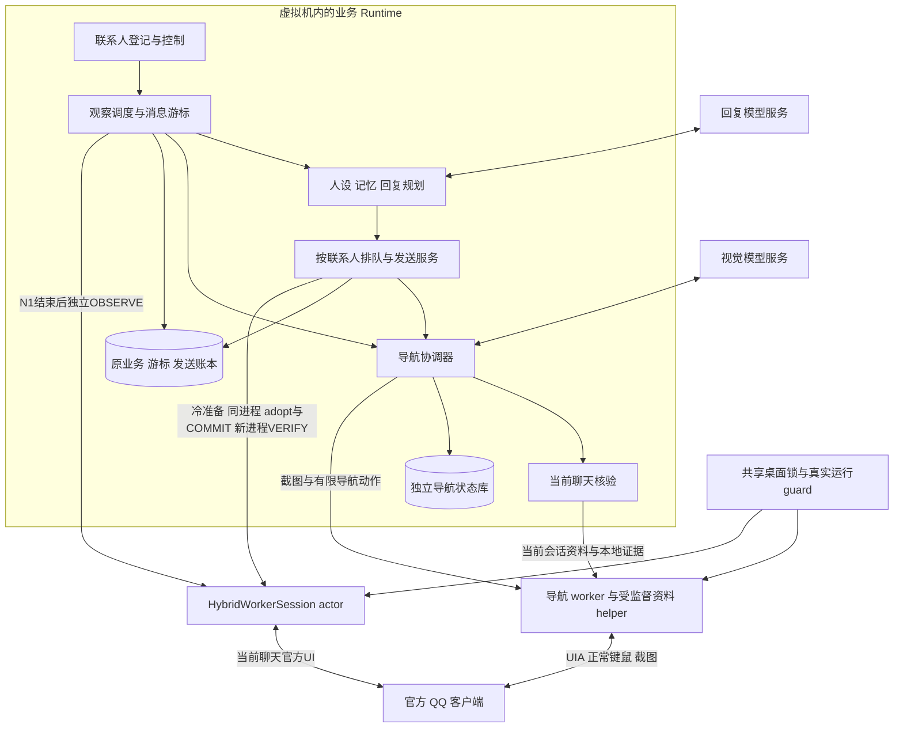
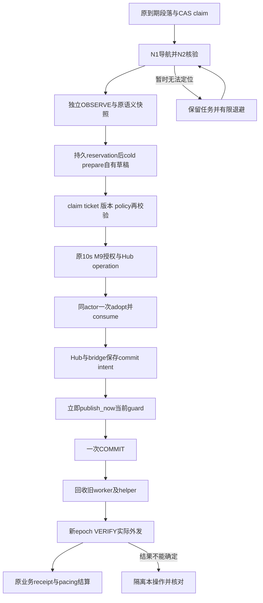

# QQ 个人聊天助手 V2 混合视觉导航架构

设计日期：2026-10-01；初始代码审查基线：`6cd99c5419b77bf49e5b8dd2c80484a701e41f79`。模块和接线说明已按 2026-10-02 的实现同步，初始基线不是当前工作树的发布版本。

本文确定 V2 的实现边界：**由视觉模型提出联系人寻找、列表重排和必要导航恢复的有限动作，由程序负责区域许可、当前身份核验、消息读取、联系人隔离、回复调度、输入、提交与结果记录。** 保留现有 Python Runtime 和 QQ 虚拟机，新增独立导航与当前聊天执行路径，不合并另一套 Agent 产品，也不搬迁全部业务数据库。

**状态（2026-10-02）：独立 V2 runner、生产装配、supervisor 显式启用、导航/N2 核验、staged prepare/adopt 和新进程 VERIFY 已有实现。当前会话和一次不同起点的生产装配只读探针已通过；一次实际冷准备的 PREPARE/ABORT 失败，测试草稿后来已人工清除并完成精确记录结算。实际 V2 发送为零，自动草稿恢复及 G1–G4 未通过。** 正常 Runtime 保持停止和暂停。原失败 `4619dcc2`（PREPARE 21.938 s `hybrid_ui_action_failed`、ABORT 2.946 s `cleanup_required / needs_manual_cleanup`）仍是失败样本。QQ 菜单全选/剪切人工清除后，`1d649d31` 只读确认空 composer；`432b145a` 用两次独立 fresh empty 读取和原 scope/RID/selected/config 核对、私有 fsync evidence 与 full-row CAS，仅结算该 reservation 为 `cleaned / manual_cleanup_verified`。这是人工恢复，不是 replacement actor 的 ABORT 成功；原业务、游标、三个旧操作、零 commit 和 revision 49 保持。

后续 `cddb7d78` 只执行 N1 current-profile：12.849 s profile HMAC 匹配，但 `identity_evidence_stale` 在 28.574 s 返回 `needs_attention`，未进入草稿或输入，也没有 raw input error。全部 worker 回收、暂停恢复至 revision 51、diagnostic reservations 为零、无 cleanup obligation、无业务 DB 变化。该次不能确认 placeholder-COM 根因；定位仍未完成。

较早冻结树全量 pytest 为 3410 passed、2 skipped（109.78 s）；shared structure 与 verified-click 分别通过 750、825 项 targeted 检查，不能叠加。之后有限十种 composer 错误码分类通过 212 项 targeted 检查，尚无该后续代码的新全量结果。实机诊断 `52dd491f` 从 QQ 游戏中心起点以 1 model / 1 click 完成 full N2，N1 `candidate_opened` 32.189 s，独立新 epoch OBSERVE 14.300 s/13 bubbles；全部 worker 回收、global pause 恢复、原配置 SHA 保持。此前 `008b` 保留为原 45 s 预算内资料采集超时样本。此前 `uv build` wheel 也对应更早代码，发布前须重建；新 release 尚未冻结或安装。单次只读成功和人工清理均不升级为 G1 或发送验收，详见 [实现状态](IMPLEMENTATION_STATUS.md)。

本文接替 [V1 架构](ARCHITECTURE-V1.md) 中的驱动、导航、身份交接和实施顺序；V1 的产品范围、人设与记忆、控制语义、持久化原则和备份要求继续适用。两者冲突时，以本文明确覆盖的部分为准。

## 1 产品范围和成功标准

交付范围仍是一个专用 Windows 虚拟机、一个正常登录的官方 QQ 客户端、多个一对一联系人、文本收发及原人设的分段回复。每个联系人有独立的记忆、消息游标和待办；用户可以暂停、停止和接管。

仅使用 UIA、正常键鼠和可见界面截图。QQ 私有协议、Hook、注入、内存或客户端数据库读取、调试接口不进入方案。保持现有 `content_policy_checks_enabled=false` 的用户设置；联系人核验和防止重复发送属于执行正确性，不是内容审查。

首个交付目标是可重复完成真实收发，随后证明多联系人切换和恢复。图片、语音、文件、群聊、自动加好友、跨账号和通用电脑 Agent 不扩大到 V2.0。

用户已指定整个账号为测试账号；当前实机记录使用“妈妈”。自动处理的联系人仍由已登记 binding、明确的 active-binding 集合和外部身份锚点决定，不能从列表里自动新增。多联系人验收须准备足够的完整测试绑定；现阶段合成窗口用于隔离、并发和同名负例。

## 2 现有证据和本次改变

| 已确认事实 | 对 V2 的影响 |
|---|---|
| 已能接收真实消息并生成回复计划；本轮尚无已验收的正常实际发送 | 保留业务成果，优先完成桌面收发闭环 |
| r15 普通 worker 的 PREPARE 约 47.7 秒、ABORT 约 68.4 秒 | 除定位正确率外，还要测量每一阶段耗时，避免更换定位后仍被旧核对拖慢 |
| 旧视觉选择只核对程序预先找到的一行联系人 | 新 `ResponsesVisionNavigator` 使用独立闭合导航契约；旧单行路径保留兼容 |
| 旧 `_resolve` 依赖登记的行定位；后续核对仍比较行位置和临时标识 | 新 `HybridQQWorker` 只核验实际当前聊天，不调用旧定位路径；原 locator 不被改写为新的身份锚点 |
| 前一次 before/after 位置变化导致 PREPARE 失败，但没有保留当时两个矩形 | 该次原因不能进一步断言；新实现记录足以区分位置变化和身份变化的有限诊断 |
| 已有消息游标、发送意图和不确定结果处理 | 继续作为事实来源，导航模型不能另建一套消息或发送账本 |

这些是当前代码和 [实机记录](IMPLEMENTATION_STATUS.md) 所支持的边界。视觉方案是否更可靠、更快，仍是需要对照验证的假设。

## 3 总体结构

图中的模块不是微服务。视觉模型调用由 Runtime 内的协调器管理；UI worker 只执行受限的本地命令，不带模型 SDK，也不持有 COM 控件等待网络返回。聊天回复模型与导航模型可以使用不同服务、版本和超时，它们不共享任务上下文。

一个桌面始终只有一个执行所有者。N1 服务和 N4 hybrid round 使用生产装配传入的同一个 `asyncio.Lock`；runner 还沿用整实例的运行所有权 mutex。一个导航回合在等待视觉结果时保留短时桌面租约，以免本程序自己切走窗口。超时或取消先撤销动作资格，再确认 worker 及自有 helper 已退出，才能释放锁；无法确认回收时保留清理义务。回复生成、分段等待和恢复退避不占用桌面。

N1 回合内使用同一导航 worker，资料 helper 受 Windows Job 监督；回合结束完成回收。N4 的 `HybridWorkerSession` 用一个有限 actor 和串行 RPC 队列拥有 round context：OBSERVE/HEALTH 是独立有限回合，冷准备、adopt 和 COMMIT 保留同一个 worker/epoch 与原截止时间，VERIFY 先回收旧 actor，再创建新 worker/epoch。发生换代时，临时截图、COM 控件和 N1 租约失效；新进程必须独立核验。

## 4 模块接口和责任

下表使用当前实际模块和类型。端口名称表示责任边界，不意味着其全部实机场景已验收。

| 模块 | 输入 | 输出 | 责任与验收重点 |
|---|---|---|---|
| 联系人配置 `parse_hybrid_settings` / `QQHybridSettings` | 原 `QQIdentityBinding`、真实业务 revision、外部配置和身份锚点 | 只读 `ContactTarget` / `ProfileIdentityExpectation` 映射 | 配置不能登记新身份或以昵称合并记忆 |
| 观察入口 `NavigatingHybridDriver.observe_conversation` | 原业务 conversation 和 revision | `ObservationBatch` | N1 成功后仍执行独立 N4 OBSERVE；N1 lease 不直接授权读写 |
| 导航协调 `NavigationCoordinator` / `QQHybridNavigationService` | target 或 binding_id、`pending_input_key`、取消和预算 | `RuntimeNavigationResult` | outcome、task_id、retry_at 与可选 N2 lease 分离；持久限制回合和动作 |
| 视觉端口 `VisionNavigator` / `ResponsesVisionNavigator` | `NavigationRequest` | `NavigationProviderResult` | 单个 `NavigationDecision`、固定错误或取消；无发送/记忆/控制权限 |
| 桌面端口 `DesktopOperator` / `ScopedDesktopOperator` | target 截图请求或带当前帧的 decision | `NavigationFrame` / `DesktopActionResult` | 经 `WindowsNavigationBackend` 执行；校验真实区域、窗口、guard 和 deadline |
| N2 `CurrentChatVerifier` / `ProfileCurrentChatVerifier` | target、frame、期限和外部 expectation | `ActiveChatVerificationResult` | 资料采集前后独立本地 witness；模型完成声明不是凭据 |
| 当前聊天执行 `HybridQQWorker` / `WindowsHybridCurrentChatPort` | 可信封闭命令、原游标期望与当前 UI | bubbles、准备 ticket、操作证据 | 不导航，不使用旧登记行来选择；每次关键输入仍有 fresh fence |
| 受监督会话 `HybridWorkerProcess` / `HybridWorkerSession` | 固定 production factory、闭合 RPC | 有限 worker 结果、清理状态 | actor 拥有 ContextVar round；Windows Job 回收 helper 后才释放桌面 |
| 到期与发送 `DueCoordinator` / `SendDispatcher` / `QQHybridDriverBridge` | 原待办、授权、staged ticket 与 operation | 准备、一次提交、结果核对 | 复用 Hub、M9、pacing 和原 receipts；无自动发送重试 |
| 恢复与状态投影 | 阶段结果及已持久事实 | 重排任务、待处理状态和诊断 | 区分导航暂不可用、身份歧义、自有草稿、未知发送 |

核心异步接口为 `VisionNavigator.decide(request, cancel_event=...)`、`DesktopOperator.capture(target, deadline_at=...)`、`execute(request, decision, cancel_event=...)` 和 `CurrentChatVerifier.verify(target, frame, deadline_at=...)`。生产服务的 `navigate(binding_id, pending_input_key, cancel_event=...)` 隐藏 native worker 配置；模型不创建 target、worker 或 guard。业务 staged 端口单独提供 `prepare_draft`、`adopt_prepared`、`abort_owned_ticket`，不能通过导航动作调用。

UIA 能稳定读取的消息正文、输入框和资料字段继续走程序；视觉用于已知脆弱的定位步骤，可以作为该步骤的正常路径，不要求先把旧路径运行到超时。已在目标会话且证据仍有效时，不为每条消息强制调用视觉模型。

## 5 导航数据和动作契约

### 联系人目标和画面

`ContactTarget` 包含 `account_id`、稳定 `conversation_id`、`binding_id/revision`、允许的会话类型、可信登记的显示名或搜索别名，以及当前身份核验模式。坐标、行号、RuntimeId 和模型生成的名字不能成为联系人主键。

`NavigationFrame` 至少包含 `frame_id`、`run_id`、QQ 会话代次、桌面租约 ID、窗口与工作进程代次、捕获时间、窗口尺寸、DPI、裁剪区域原点和像素尺寸、允许操作区域，以及图像。模型输出使用截图局部坐标；由 worker 按该帧元数据换算到来宾屏幕，禁止混用宿主 VirtualBox 窗口坐标。

生产后端以 `PrintWindow` 采集 exact HWND，并用新鲜 UIA 语义区域确定许可范围。只有完整可见联系人行的昵称碎片及可信搜索框像素可保留；preview、正文、composer、标题及其他非许可像素被确定性遮挡。已知 overlay 只能使用显式支持的区域。资料标识通过正常 QQ 资料 UI 在本地取得并 HMAC，不发给导航模型。导航不读取人设、记忆、候选回复或密钥，provider 输入也不包含业务账号/会话 ID。

### 模型能提出的动作

V2.0 使用闭合的动作集合：`click_candidate`、`open_search`、`set_target_query`、`scroll_list`、`dismiss_known_overlay`、`wait`、`candidate_opened`、`unable`。一次响应只有一个动作或结果。

- `click_candidate` 携带当前帧内候选 bbox 和 `observed_label`；完整 bbox 必须包含在可信 candidate 区域内，标签仅作诊断。`validate_decision` 同时核 frame_id、action 参数和 alias index；native 输入边界再次核当前区域和窗口，不以模型声明建立许可。
- `set_target_query` 只携带 `query_alias_index`，文字来自 target 的 `trusted_queries`。程序重新证明是可信搜索框且获得焦点后才 SetValue；导航协议没有任意文字、任意按键或 Enter 能力。
- `dismiss_known_overlay` 仅适用于已支持的关闭或取消动作。未知弹窗交回协调器，不允许任意确认、账户设置或付款动作。
- 模型不能按发送键、操作聊天输入框、打开任意应用、运行 shell、改绑定、改暂停状态或宣告消息已送达。

新路径不依赖旧 `_locate_conversation` 或已登记行的 RuntimeId。它仍要求能从当前官方 UI 证明 list、search、nickname 的可信区域；无法认证区域时明确拒绝，不退为整屏截图、OCR 猜测或模型任意坐标点击。当前实现不把“视觉能看见”当作输入许可。

### 画面失效和进度

执行前检查 run、会话、窗口、租约、控制版本、画面尺寸和相关导航区域是否仍匹配。列表重排、窗口缩放或人为接管时，丢弃旧动作并重新截图；不要求整个 QQ 窗口所有像素完全不变。截止时间和置信度都不能证明画面仍然有效。

截图与点击之间仍可能存在外部变化，无法宣称原子操作。因此点击只产生“动作已尝试”，必须读取实际打开的会话。模型自报置信度只用于诊断，不作为联系人身份或发送资格。

当前策略只在有效 `CLICK_CANDIDATE` 返回 `action_attempted`、无 error 且取得新 next_frame 后，立即做 full N2 验收，使一次候选选择可按 1 model / 1 click 进入核验，不依赖已遮挡的模型画面宣布聊天已开。initial other-title/non-chat 分支只证明“当前不是目标聊天”，不能签 lease。backend `_scope` 前后核真实 guard/native geometry，不执行未使用的 UIA 整树扫描。

仅 `CLICK_CANDIDATE` 和 `OPEN_SEARCH` 可使用显式 `verified_click(frame, region, x, y, deadline_at, cancel_event)` producer capability。Windows child 的闭合 command 必须携带 frame、region、x/y，独立证明 exact owned candidate/search region 唯一包含输入点；同一次 command 完成一套完整 fresh UIA/PrintWindow、frozen/current ROI digest 比较及最终 guard/native point proof，再执行一次输入并消费旧 frame。外层两个 scope 检查与 postcapture 保留；不接受 boolean 开关、caller 声称已校验的 digest 或跨 RPC 的 current-frame 缓存。generic backend 继续 digest0/1 与独立 click，query/scroll/search-focus 不走此 capability。输入前 ROI 漂移保守终止；任何不确定输入、超时或 postcapture 失败仍退休并回收 worker，不重复点击。

离线实际模块链验证单次专用 execute 使用一次 fresh ROI proof 加一次 postcapture，共 4 个 UIA phases、2 次 PrintWindow；generic execute 仍为 6 phases、3 次 PrintWindow。计数不包含 initial capture 或 full N2。这省去一次重复完整采集，不减少身份检查、不延长时限或 TTL。实机样本 `52dd491f` 的专用 click 为 4.597 s、含 postcapture 的 execute 为 8.756 s；一次样本不能证明常态延迟或性能百分位达标。capture 的一次 fresh-read rebuild 仍仅允许 exact `UIA_E_ELEMENTNOTAVAILABLE`（`-2147220991`），不能重试输入或续租。

生产预算为每回合最多 4 次视觉请求、6 次桌面动作、45 s 原总时限，单次模型请求最多 15 s 且受剩余时间限制。工作期限提前扣除 0.5 s cleanup reserve，回收仍在原总期限内；UTC 和单调时钟都不能延长回合。重复画面/动作无进展被显式终止，搜索和滚动仍消耗同一预算。provider 模型/endpoint 可配置，当前配置的输出预算为 512 tokens；DeepSeek 的 `flat_primitive` wire schema 转回相同闭合本地 decision，不能放宽动作参数校验。

预算耗尽后撤销回合，确认回收才释放桌面；持久保留待办并退避至少 10 s。5 min 内最多 3 个未成功回合的限制按 account/binding 计数，新 pending_input 或 worker 重启不能清零；成功回合不占失败限额。重启不能继续旧动作，未确认清理的持久 obligation 仍阻止新桌面回合。达到限额返回固定错误与 retry_at，不无限滚动或自动扩大时限。

## 6 当前会话核验与身份交接

当前会话关联仍是 V2 的技术关口。旧实现把注册时的行 RuntimeId 和选中行几何证据贯穿后续操作；新路径只使用本次 selected token 关联新鲜证据，不把注册位置或 RuntimeId 当成持久身份。微软说明 UIA RuntimeId 只在生成时的桌面范围内唯一，之后可能被复用，因此不适合作为长期联系人身份。[UIA 官方说明](https://learn.microsoft.com/en-us/windows/win32/winauto/uiauto-usefortesting)

导航完成后的结果仍只是候选。核验器从新取得的当前标题、会话类型、正常资料页或其他已验证的当前会话关联证据中核对目标。昵称、头像或模型说“是妈妈”均不足以自动创建新绑定。

| 核验模式 | 成立条件 | 自动恢复边界 |
|---|---|---|
| 持久身份模式，当前 V2 production 配置 | `ProfileIdentityExpectation` 的外部 HMAC anchor 与正常 UI 资料采集匹配，并由前后 witness 证明属于当前聊天 | 允许重新定位；QQ 重启后必须显式更新认证 session/settings，不能凭昵称恢复 |
| 会话内绑定模式，旧兼容路径 | 用户已确认且仍有效的 QQ 会话证据能够证明关联 | 不属于当前 hybrid production factory 的可启用模式；不能把旧 signature 填成外部持久身份 anchor |

UIA 稳定字段优先。OCR 或视觉可以帮助读取资料，但若只能获得易混淆的图片文字，必须先验证提取与当前聊天的关联能力；不能把模型自报的高置信度升级为持久身份。若两种模式都无法建立可复验关联，只能完成导航演示，不能宣称自动发送架构已验证。

`CurrentChatWitness` 是一次本地读取的封闭值：唯一实际 selected row、当前标题与聊天结构摘要、direct/group 分类、完整 group-marker 探测、最新 tail、composer 状态及完整 scope。selected token 为当前 RuntimeId 的 `sha256('.'.join(str(x) for x in RuntimeId))`，只关联本次前后证据；它不查旧 locator、不重登记联系人。显式 `non_chat` 分类可帮助区分起始页缺少聊天控件和身份失败，但本身不能签发 lease。

N1 与 N4 使用共享 `current_chat_structure` 投影：仅从 composer ClassName 删除 exact `ProseMirror-focused`、`is-empty` token 及其一个相邻分隔符，保留角色次序、三个 RuntimeId、header/message class 和其余 composer token。正常资料页造成的焦点/空值状态变化不再被当成控制实例更换；真实 focus、empty/owned contents 仍由独立输入边界检查证明。投影不替代前后聊天关联、profile HMAC、ambiguity/group 拒绝或 C# 资料关联证据。修复已离线测试；实机样本 `52dd491f` 在 raw composer focus token 消失后仍保持同一 local structure digest、通过 full N2 HMAC，但 G1 的完整不同起点和身份负例验收尚未完成。

`ProfileCurrentChatVerifier` 结合正常 QQ 资料采集的 HMAC、独立前后 witness、同一 header/selected/structure 关联与 scope 签发 `ActiveChatLease`。lease 包含账号、业务 conversation、binding revision、run/session/surface/worker epoch、观察/桌面租约、PID/HWND/process-start、证据摘要、control revision 及双钟期限；最大 TTL 为 15 s。cleanup 后协调器仍检查其未过期。它不能由模型填写，也不要求登记行还在旧位置。`candidate_opened` 模型结果和 `NavigationOutcome` 单独不包含发送资格。

旧 `_header_digest`、登记 `participant_signature` 和同名检查本身不是独立资料身份。当前 hybrid worker 用新鲜当前聊天证据产生 `QQCertifiedDirectIdentity`，并核对外部 profile HMAC；它不把 `_by_locator` 简单改名后放行。原业务 binding 的 locator/signature 仍原样保存，N2 证据与该业务投影分别校验。当前会话只读实测支持这条接线，但重排、同名切换与完整发送验收仍未完成。

以下事件使租约失效：切换会话、失去可确认的当前聊天关联、窗口重建、QQ/worker 换代、控制或绑定变更、到期。新消息不必使身份失效，但必须增加业务会话版本并触发待发计划复查。

程序自己的 surface epoch 无法发现全部人工切换，特别是同名会话之间的切换。每次消息读取及 PREPARE/COMMIT 的关键边界仍需本地新鲜核验当前聊天关联；“零模型快路径”不等于零核验。短 TTL 或没有收到导航事件均不能替代该检查。

### 真实运行 guard 与桌面所有权

`QQHybridRuntimeScope.snapshot(*, target, purpose, worker_epoch, deadline_at, desktop_lease_id, observation_epoch)` 从实际 Runtime SQLite、同步 pause fence、原 bridge operation 和新 reservation 读取控制版本及在途义务；模型不能提交或更新这些 flags。`QQNavigationGuardPublisher` 在已获得共享锁后首次成功原子发布，factory 才创建 native worker。每个 epoch 使用独立绝对 guard 路径；heartbeat 与 `publish_now()` 串行，刷新 published_at 不续桌面租约。失效、暂停、错误 epoch/target/window/start 或未知外来草稿均不能授权输入。

`QQHybridRoundFactory(...).__call__(*, binding_id, purpose, worker_epoch, deadline_at)` 是 `HybridWorkerSession` 的固定可信 round factory，purpose 只允许 observe/draft/verify/health。actor 生成非零 UUID，配置必须采用同一 epoch；其 queue RPC 只传闭合值。worker 通过短 ContextVar capability 继承受保护回合，不能依靠“同一个 target”重入另一调用者的锁。取消同步 revoke，迟到结果丢弃；确认 Windows Job 的自有 helper 已退出、worker 已 reap 后才停止 publisher并释放锁。失败保留原 owner/context，由精确 `retry_cleanup` 清理，不能跨任务 reset 或猜测桌面已安全。

N1 完成并回收后，业务 OBSERVE 或 cold preparation 进入独立 N4 round，重新核验当前聊天；不能用 N1 lease 直接授权 N4 输入。当前实现不把新字段塞进旧 `SelectionHandoff`，也不把稳定联系人 ID 冒充其 runtime digest。原兼容 handoff 与新 hybrid 准备/核验凭据分开，所有 IPC 都是封闭值，不能传 COM 对象。

`PreparedDraftTicket` 绑定 reservation_id/nonce、原 outbox claim、due event/段落/draft、正文 hash、source keys、binding/conversation/global revision、run/session/surface/worker epoch、原双钟 deadline 和期望序列摘要。cold prepare 还返回可移交的 `PreparedVerificationEvidence`；bridge 先验证并持久保存，再允许同 worker 一次 adopt。VERIFY 使用该已保存证据，在新的 worker epoch 独立核验当前聊天和实际外发后缀，不沿用旧 worker 的输入许可。

已准备后进入 COMMIT/VERIFY/ABORT 时，不再先扫描并匹配旧联系人列表。它们使用当前聊天及本操作的证据；有任何无法确认的切换就停止当前动作。减少行像素和几何依赖须以错误联系人、同名者和群聊负例证明等效的结果约束。

## 7 收发流程和恢复边界

观察流程先取得当前会话关联，再由独立 `HybridQQWorker` 执行 OBSERVE，bridge 使用原 `MessageCursorStore` 对齐并产生业务批次。首次登记的 adoption 边界、原始事件、本地消息序号和已提交 outbox 保持原样。模型不负责猜哪些气泡是新消息，也不负责去重。

“最新观察”必须证明消息区处于当前会话的最新尾部，保留现有 tail 检查，并在读取后再次确认；仅有新的截图时间或可见列表末项不够。若需要回到底部，由受限的消息读取动作完成，随后重新核验会话与尾部。不能证明处于最新尾部时，不推进游标、不签发发送用语义快照 token；导航结束但消息区停在历史位置也适用此规则。

到期段落在尚未创建新的 Hub 发送操作、消耗发送许可或写入输入框之前完成导航和版本复查。目标聊天内出现新入站或人工外发时，先更新上下文并重新评估回复；分段计时不持有桌面。

最新 OBSERVE 保留原 `MessageCursorStore` 的语义快照。`QQHybridDriverBridge._cursor_expectation` 从持久 cursor 取期望序列摘要，并在 prepare IPC 中显式传 `expected_sequence_digest`；worker 用相同 `semantic_snapshot_token` 算法核实际 bubbles，不能自选新基线。`expected_last_message_key` 仍保留，但不单独充当完整序列证明。新消息、对齐缺口或版本变化在写入前使旧计划失效；已有自有草稿时先精确清理，不能悄悄采用新快照继续旧回复。

实际授权前端口是 `DueNavigationPreflight.check`，不是拟议的 `ensure_active_chat`。`DueCoordinator` 在 claim 的 CAS 范围内做导航/观察和 artifact 复查；暂时失败保留原段落，attention 与已有 operation recovery 分开。新 `StagedPreparationController` 先做可逆 cold preparation，再重校 claim、原计划/规则/版本/ticket，最后调用原 `authorize_due` 签发 10 s 授权。此时才创建新的 Hub send operation，并由 `SendDispatcher._execute_staged` adopt 精确 ticket、消费原 token、提交和结算。旧非 staged dispatcher 仍作为兼容路径保留。

`QQHybridDriverBridge` 在 prepare IPC 前持久化 `preparing` reservation，在 adopt IPC 前持久化 `adopt_intent`。ack 丢失、取消或 cleanup 不明不会忘记草稿所有权。原 cold round 的总预算固定为 45 s，写入前保留 20 s；prepare/adopt/COMMIT 使用同一 session actor/worker/epoch，不通过另一个调用重新取得 45 s。N1 的共享锁已在成功回收后释放，N4 必须重新拿锁和真实 guard，不能把“导航成功”当作持续拥有桌面的凭据。

授权消费后，Hub 和 bridge 分别保留各自既有 commit intent；bridge 随即 `QQHybridRoundFactory.refresh_guard(UUID(ticket.worker_epoch))`，等待 publisher 的 `publish_now()` 从实际 runtime 状态原子发布新义务，再发 COMMIT IPC。这样持久化 commit intent 引起的正常 flags 变化不会在下一次 heartbeat 被误作漂移；刷新不延长 deadline。若刷新、输入或 ack 不明，原 operation 进入 hold/UNCERTAIN，不再按发送键。

VERIFY 可有一个独立的原始有界只读回合：`HybridWorkerSession.verification_round(command)` 先 close/reap old actor，再由相同可信 factory 创建新 UUID epoch。新 worker 核 saved proof、当前聊天与外发后缀；不需要延长 10 s 输入授权，也不能获得新的输入权限。成功的业务 receipt 在 N2 核验后投影回原 binding 的 `platform_conversation_id` 和 `participant_signature`，保持原 cursor/receipt fingerprint。N2 profile HMAC、selected token、lease/evidence digest 是执行证据，不能充当外发 receipt、QQ 服务端消息 ID 或新的业务联系人主键。

| 当前阶段 | 允许恢复 | 禁止推断 |
|---|---|---|
| 截图、寻找、选择，尚无草稿和发送操作 | 重新观察、搜索或改选；保留同一待办与重试预算 | 不能把未完成导航记成消息处理完成 |
| cold prepare 或 PREPARE 已输入自有草稿 | 停止视觉导航；核对 exact reservation/nonce、原会话和正文 hash，只清理自有草稿；未创建 operation 的 reservation 也须结算 | 不能切到另一人后继续输入，不能清空用户草稿，不能因进程已死而认定草稿消失 |
| 已保存 commit intent 或执行发送结果不明 | 原操作的只读结果核对，必要时进入 UNCERTAIN | 不能因为超时、重启或缺少回执就再按一次发送 |
| 确认成功 | 幂等保存结果和记忆事件 | 不能因投影失败重复发消息 |
| 身份歧义或消息序列缺口 | 暂停对应会话并说明所缺证据 | 不能按相同昵称重绑，不能重置游标消除问题 |

若草稿清理义务仍存在，整个桌面保持受控，不能把另一个联系人的导航插入清理过程。已提交但结果未知的操作只阻塞对应会话；只有 worker 已退出、无自有草稿及在途输入义务时，才可释放桌面给其他联系人。

历史失败、已发送和 UNCERTAIN 操作保留原终态，不因为启用 V2 而重置、换 ID 或重放。新导航任务只关联仍合法的待办，不复活过去的失败回复。

## 8 多联系人观察和公平调度

联系人隔离沿用现有 `conversation_id`，视觉位置变化不新建联系人、记忆或游标。消息身份与序列对齐继续由 `message_decoder`、`message_cursor` 和 `sequence_alignment` 管理；截图 ID、行 RuntimeId 或像素变化不能成为新消息 ID。

当前 `message_key` 是方向和文本衍生的本地摘要，不是 QQ 服务端消息 ID；cursor v1 的身份算法已排除临时 `conversation_internal_id`。V2.0 逐字保留解码及 key 算法，不切换为模型/OCR 重写正文。无重叠或重复序列歧义时返回 gap，禁止自动 `bootstrap_last_inbound` 或整屏导入来“恢复”。

上层继续现有按 conversation 隔离的观察调度和持久 last_observed_at。未读提示优先、周期补查与最长等待兜底是多联系人验收要求；提示不能成为入站事实，缺少红点不能证明没有新消息。这不是新增导航库已经提供的完整公平调度保证，须用 G3 的实际积压和最久未观察时间验证。

每次桌面占用最多完成一个导航回合及相应读取，或者一段消息的准备、提交和核对。收发之间按到期时间和最长等待调度，同一会话不能同时观察写入。回复生成可有限并行；所有实际点击、输入和剪贴板使用均串行。

容量须实测：一轮补查耗时至少是所有联系人导航与读取耗时之和，再加发送占用。不能把“支持多个上下文”解释成无限联系人或实时零延迟。V2.0 先用 3 个测试会话验收，新增容量看最久未观察时间、积压和恢复成本。

独立聊天窗口作为后续可替换的导航策略。wxauto 明确用独立窗口减少主窗口切换导致的控件丢失，这一思路值得在 QQ 上比较，但 QQ 的能力仍未验证。[wxauto Chat 设计](https://docs.wxauto.org/docs/class/Chat.html) 无论用主窗口还是独立窗口，上层仍调用同一个当前会话端口；两种策略不各自维护业务状态。

## 9 复用和代码改动范围

| 范围 | 处理方式 | 代码入口 |
|---|---|---|
| 人设、记忆、回复模型、分段节奏 | 保留；只补充必需的版本或取消接线 | `rules/`、`memory/`、`llm/`、`pacing/` |
| 导航契约、判断与协调 | 已新增有限模块，不复制完整 Agent 框架 | `navigation/contracts.py`、`ports.py`、`provider.py`；`runtime/navigation.py`、`navigation_state.py` |
| 截图、坐标和有限动作 | 独立导航 backend/worker；复用低层 UIA/编码思路而不调用旧定位 | `navigation/desktop.py`、`windows_backend.py`、`worker_process.py`；`vm_driver/phase_index.py`、`transport.py` |
| N2 当前会话证据 | 新资料关联契约与受监督采集；旧单行路径保持兼容 | `navigation/identity.py`、`profile_verifier.py`、`supervised_profile.py` |
| N4 当前聊天业务执行 | 独立 worker、受监督 IPC、有限 actor、durable bridge；不改旧定位身份为新含义 | `vm_driver/hybrid_worker.py`、`hybrid_process.py`、`hybrid_session.py`、`hybrid_bridge.py` |
| 消息证据与游标 | 保留存储事实；检查新的会话关联不会改变消息身份语义 | `message_decoder.py`、`message_cursor.py`、`sequence_alignment.py` |
| 授权前导航及可逆准备 | 已接显式 preflight、staged request/ticket/cleanup 与原授权路径 | `runtime/due_dispatch.py`、`staged_preparation.py`、`send_dispatcher.py`、`assembly.py` |
| 配置、scope、guard 与 production 服务 | 新外部配置与真实 flags 接线，共享桌面锁 | `runtime/qq_hybrid_config.py`、`qq_hybrid_scope.py`、`qq_guard.py`、`qq_hybrid_navigation.py`、`qq_hybrid_rounds.py` |
| CLI、发布与状态 | 独立 opt-in runner，沿用成熟 supervisor 和 run UUID 控制 | `scripts/run_vm_runtime_v2.py`、`scripts/deployment/qq_session_runtime_supervisor_guest.py`、guest release scripts |

现有 `ConversationSelectionActuator` 依赖先找到的一行及严格旧矩形，不能直接充当新 `VisionNavigator`。新 provider 复用图片传输/结构化返回思路，使用自己的闭合 `NavigationRequest/Decision`；`NavigationWorkerCommand` 仅供导航 worker，不能发给旧业务 worker。N4 复用既有 `WorkerCommand/WorkerResult` 的业务形状，通过新的固定 hybrid factory 执行；额外 prepare/adopt/abort RPC 使用独立闭合类型，不把未知字段静默传入旧路径。

旧 `worker._resolve/_locate_conversation/_select_conversation`、session locator/certifier 和 `SelectionHandoff` 仍是 legacy 路径，不被整体替换。新 `QQHybridDriverBridge` 只复用原 cursor、业务 operation、receipt 和状态存储，覆盖当前聊天执行/准备/提交/核验边界。外部 hybrid settings 要求 persistent 身份模式及真实 business binding revision；session_epoch 必须等于原 canonical session revision，不能用 W1 locator refresh 自动创建 HMAC anchor，也不能改 original generation 来绕过 scope。

UI-TARS 的截图与动作执行接口、逐步观察循环和取消机制可供实现参考；其 SDK 标为实验性，当前 Python 项目不为了接入它先增加 Node 常驻服务。[UI-TARS SDK](https://github.com/bytedance/UI-TARS-desktop/blob/main/docs/sdk.md) 先以 `VisionNavigator` 端口做窄适配，具体模型必须验证图像输入、坐标输出、中文联系人识别、延迟和调用成本；文本模型可聊天不代表能完成视觉导航。

用户的 [companion-agent](https://github.com/liuxueqi0044/companion-agent) 可借鉴持久任务、真实工具结果回传、停止和循环预算设计；其 [CORE-014](https://github.com/liuxueqi0044/companion-agent/blob/main/docs/development/CORE-014.md) 是受控任务循环，通用电脑操作仍在 [后续范围](https://github.com/liuxueqi0044/companion-agent/blob/main/docs/handoff/CURRENT-TASK.md)。V2 不把它变成运行依赖，不再增加一套发送账本。

## 10 持久化与运维

V2.0 继续使用现有业务库及跨库核对，不把全面合库作为前提。production 装配在原 data_dir 新增独立 `qq-v2-navigation.sqlite3`，由 `NavigationTaskStore` 管理，不属于 `runtime.sqlite3` 的 RuntimeState。其表为 `runtime_nav_tasks`、`runtime_nav_episodes` 与 service 的 `runtime_nav_cleanup_obligations`。稳定任务键绑定 account、conversation、binding/revision 和 `pending_input_key`；保存 target、状态、错误/retry_at、owner/deadline 和模型/动作预留计数。截图、bbox、活跃 lease 不作为重启后的可执行动作保存。

bridge 在原 `qq-vm-bridge.sqlite3` 增加 `qq_v2_draft_reservations` 等准备证据/所有权记录，继续使用原 `qq_vm_ops`、`qq_vm_receipts` 和 cursor 库，不另建业务发送账本。Hub、M9、pacing 的既有库和结算事实保持。新增表不重置旧 operation、adoption、message key、memory 或 persona；跨库 CAS/claim 核对仍必需。

配置不是给旧 canonical 添加一个 mode 字符串。`QQHybridSettings` 解析独立 `qq_hybrid_runtime_v2` JSON，冻结已注册 targets/expectations、当前 session/surface、可信 helper/vault、guard directory、45/20 s 设置与 navigation model。`--hybrid-settings` 和明确重复的 `--active-binding` 是实际 CLI；固定 SHA-256 在 supervisor 捕获后传给 runner 再校。原 `--config` 是 immutable business/session snapshot，canonical 仅经 `--publication-config` startup fence；`--expected-session-binding-revision` 保留 legacy=1 及真实 revision 语义。`--check` 不启动 UI/API/worker，不创建新的签名 key，也不改任何原配置。

实际 task 状态为 `pending → running → candidate_opened / retry_wait / needs_attention / cancelled`；episode 还记录 `abandoned`。新 store 实例不能接管仍在原 deadline 内的 running episode；过期 episode 计为 abandoned，保留计数与 cooldown。独立 cleanup obligation 不能仅因 deadline 过期或重启而删除，必须确认其真实 worker/helper 回收。新导航状态不能覆盖已有 operation 状态。

持久化的 `candidate_opened` 仅表示此前曾核验成功，不是跨重启的输入资格。恢复时其临时证据/lease 失效，保留原 task scope 和预算；若存在准备 reservation 或原 operation，先走其精确清理/核对阶段，不据成功导航记录创建第二个 operation。准备不明、未回收进程和 commit uncertainty 分别保留 hold，不伪造“清理成功”。

正常诊断记录固定阶段/错误、scope 引用、耗时、尺寸、模型使用量和计数；导航状态库不保存 PNG 或消息文本。guard/cleanup 文件和完整身份/准备证据是私有运行数据，公开投影只含有限状态。若单独采集本地图像诊断，不能让它成为重启后的动作许可，也不能进入仓库/公开报告。模型输入画面视为数据，不能修改系统动作范围。

当前 runner 写有限 `qq_hybrid_runtime_status_v2` witness，supervisor 按 actual run UUID、fresh witness、真实 DB scope/global revision 和本轮成功观察判断 ready；有限 session 的 idle 不等于 worker 故障。原 WebUI、pause/error 和 run-scoped 文件控制继续使用。更细的寻找/输入阶段展示是运维体验目标，不能据架构标签宣称已完成 UI。暂停立即阻止新动作，迟到模型结果失效；排空 UI tick/回收 worker 后才确认 paused/stopping，保留原人工接管语义。

## 11 实施模块和顺序

下表将原工作包映射到已落盘的实际产物。实现、离线负例、局部实测和完整验收分别记录；模块存在不代表已经通过该工作包全部场景。每包只修改明确所有权文件，不能用放宽身份、序列或时限检查掩盖失败。

| 工作包 | 目标和产物 | 依赖 | 独立验收 |
|---|---|---|---|
| N0 可行性与证据 | exact-window PrintWindow、资料 HMAC、本地 witness、合成图视觉 API 已有分项证据 | 无 | 能解释点前与点后的联系人关联；不输入聊天消息 |
| N1 导航与执行 | `NavigationFrame/Decision`、provider、ScopedDesktopOperator、backend/process、coordinator/store 已实现 | N0 契约 | 真实无发送导航须通过重排、滚动、焦点、过期响应案例；当前不同起始页仍诊断 |
| N2 当前聊天核验 | profile verifier、受监督 helper、短期 lease 与独立 current witness 已实现 | N0；与 N1 协作 | 点错、同名、群聊、窗口重建不被误放行；正确重排不误拒 |
| N3 授权前与业务时序 | due preflight、staged controller/adapter、dispatcher、原游标序列期望已接线 | N1 和 N2 | 导航失败保留待办；原授权不延寿；输入/提交后无视觉重试；崩溃不重复回复 |
| N4 当前聊天执行与监督 | hybrid worker/process/session/bridge、exact prepare/adopt/abort、新 epoch VERIFY 已实现 | N2 和 N3 | IPC 取消/截止/失ack保留义务；Job回收；真实 prepare/adopt/commit/verify 仍须 G2 |
| N5 production 与验收 | 独立 config/scope/guard/navigation/round factory、runner、supervisor opt-in、release 打包已接线 | 各包逐步进入 | 使用同一生产入口完成 G1–G4，验证多联系人公平性、持续运行与回退 |

依赖顺序为 N0 → N1/N2 → N3/N4 → N5 验收，部分纯契约和监督测试可并行。当前截图已选用 PrintWindow；exact-HWND WGC 仅保留为截图不兼容时的第二候选，不增加通用桌面服务。对具体身份或性能失败先定位证据和耗时，不增加第三条实现、放宽 proof 或延长 45 s 来制造通过。

## 12 验收门槛

以下为验收门槛。已有大量离线契约/取消/清理负例及少量当前会话只读实测；这不等于整个 G0 样本档案或 G1–G4 已通过。当前 G1–G4 均未完成，实际 V2 发送为零。冻结代码、QQ 版本、分辨率、模型和样本；报告全部尝试，区分成功、正确拒绝、误拒、误点后纠正和未恢复，不能只收集成功截图。

| 阶段 | 场景和样本 | 通过条件 |
|---|---|---|
| G0 离线契约 | 同名、过期画面、DPI/缩放、越界点击、提示注入、迟到结果、暂停、模型格式失败 | 错误候选不会变为有效会话；模型不能触发输入框或发送；无副作用失败可保留任务 |
| G1 无发送导航 | 6 类场景各 5 次：已在目标、重排、屏外目标、焦点变化、已知弹窗、窗体位置/尺寸变化 | 每类至少 4/5 自动到达正确会话，总计至少 29/30；失败均明确停在导航阶段；至少 30 个有效样本而非重复到成功 |
| G1 身份负例 | 同名未登记候选、人工同名切换、错误联系人、群聊、身份不明、账户/窗口/worker 换代、handoff 重放 | 零错误 ActiveChatLease；新 worker 必须独立重核验；证据不足如实拒绝，不能把全部拒绝计为导航成功 |
| G1 消息位置负例 | 导航后停在历史位置、重复文本页面、无连续重叠、读取途中消息区变化 | 不能证明最新尾部与连续序列时，不推进游标、不签发发送快照、不触发旧消息回复 |
| G2 正式单联系人 | 至少 20 轮有效可发送交互，含重复文本、连续入站、分段和导航恢复；另测生成后新消息、人工草稿及取消 | 有效样本至少 19/20 无需人工补救完成；取消/失效另计正确中止；零错发/重复提交/未解释漏读；每次成功有本地结果核对，另记测试端确认 |
| G3 多联系人 | 3 个已确认测试会话，至少 30 轮有效可发送交错交互，每人至少 10 轮，含相同文本和模型生成期间切换 | 总计至少 29/30、每人至少 9/10 无需人工补救完成；零串人、串记忆、重复提交和饥饿；所有积压与延期可解释 |
| G4 故障和持续运行 | 导航 candidate_opened 后尚未创建 operation、reservation/输入前后、commit intent 前后、结果保存前崩溃；重启/断线；至少 24 小时受控运行 | 已有账本和游标连续；导航成功记录重新核验且保留预算；义务未清不释放桌面；未知发送不重试；全体故障和人工干预有记录 |

初始性能目标：常态切换至已核验会话 P95 不超过 20 秒，导航回合最多 45 秒；已在目标且有效时视觉调用为 0，常态切换中位调用数不超过 2。定位之后的读取、准备、提交和核对另行统计，目标技术耗时 P95 不超过 30 秒，不包含人设的主动等待、回复模型生成和队列等待。队列等待与每联系人最久未观察时间必须另外报告，不能从总体验中隐去。

这些是可用性目标，不是现有性能承诺。若当前读取/核对单独已超标，即使视觉导航成功也不能宣布 V2 可用；先定位耗时，再决定是否调整该模块。门槛修改须在新一轮测试开始前说明原因并保留旧结果，不能事后抬高上限消除失败。

“有效可发送”指用户授权范围内、业务已生成至少一段合法候选回复且未被后续输入作废的样本。人设选择零段回复单独记为静默结果，不能充当一次成功发送；故障或超时的有效样本不能从分母移除。

样本选择优先使用合成界面和无发送操作。真实发送仅用于已授权测试对象，继续使用正式多段流程；本轮架构设计不恢复自动回复，也不要求用户反复发新消息。

## 13 发布和回退

实际发布入口是独立 `run_vm_runtime_v2.py`。成熟 guest supervisor 仅在收到绝对 immutable JSON `--hybrid-settings`、明确重复 `--active-binding` 与固定 `--expected-hybrid-settings-sha256` 时选 V2；未指定 settings 仍选 V1，`Start-GuestLocalRuntime.ps1` 的 build/start wrapper 仍是 V1。`legacy/hybrid_observe/hybrid_send` 不是当前可填入配置的枚举，不能按旧拟定名称绕过 closed schema。

运维验收顺序仍是无发送诊断 → 受控单联系人发送 → 多联系人 → 持续运行。当前 assembly 的只读探针用于定位和分项证据，未使 G1 自动通过；G2/G3/G4 的样本与运行范围须分别满足前节要求。模型/API 成功、runner 存在或 supervisor WebUI reachable 都不能升级为已完成实际发送。

release builder 总是包含 V1/V2 两个 runner；可选 `-HybridProbeHelperPath` 把 self-contained `QQ.UiaProbe.exe` 及五个固定 native 运行 DLL 一同冻结进 manifest。guest 本地安装校验 wheel、scripts、helper，启动用 installed pythonw 直接调用成熟 supervisor。具体部署命令和 private settings 边界见 [Guest-local release contract](../scripts/deployment/GUEST_LOCAL_RELEASE_CONTRACT.md)；不把真实 HMAC、窗口/进程或聊天数据写入公开架构。

V2 沿用当前 supervisor run UUID 的 Pause/Resume/GracefulStop 文件控制：请求/结果须精确匹配 run、request 和 action。pause fence 先阻止新输入，之后排空 UI tick 和自有进程树；accepted/pausing 与最终 paused/stopping 分开，未知 timeout 不自动重试。没有新的配置或 session revision 发布动作隐含在启用 V2 中。

切换前停止并排空旧 worker，备份一致的数据检查点，保留 generation、联系人、adoption、游标、原人设、内容规则设置和历史操作。模式变更、绑定映射和 schema 版本有记录；不重建业务库，不自动重放旧失败消息。

若新的会话或消息身份语义需要变化，必须提供旧到新的显式映射与测试，保留既有本地消息 ID 和 outbox 状态；不能靠清空游标或重新 adoption 实现“兼容”。旧模式不能解释新绑定或证据时，回退仅允许暂停后的只读诊断，不能直接启动旧发送代码。

未来若改变 OCR、正文归一化或 message key 算法，须新增 `identity_schema`，不能在旧 v1 名义下改变含义。可复用现有 CAS reanchor 接口，但要求 outbox 已结算、保留 `next_seq`、不产生新入站事件，并有映射及审计；这不属于 V2.0 导航替换的默认动作。

回退首先撤销新动作资格、确认 worker 退出并核对所有在途操作，再切换兼容版本。保留当前账本，禁止恢复旧数据库快照来撤销已在 QQ 发生的外部发送。旧模式和新模式不得同时操作桌面。

V2 是否完成只以这里的阶段证据和实现状态为准。文档完成、离线测试通过、一次真实成功与持续运行通过分别记录。
