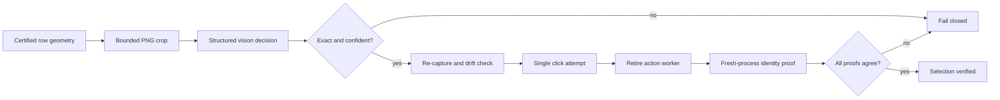

# Bounded visual conversation selection

## Purpose

Windows UI Automation can observe useful structure without always exposing a stable identity for every conversation row. This subsystem provides a narrow fallback: a vision provider may classify one already-certified row crop, but it never sees the full chat window and never controls the pointer directly.

## Trust boundary

1. A read-only worker proves the QQ process, window handle, client version and certified geometry.
2. The host captures exactly one bounded row region and verifies its size, source window and digest.
3. The vision provider returns a strict structured decision such as `exact_label`, `not_match` or `uncertain`.
4. Only an exact match above the configured confidence threshold can produce a single row-center click request.
5. The image is captured again before execution; geometry or digest drift rejects the request.
6. The executor checks that the point still belongs to the certified process/window and attempts at most one click.
7. `action_attempted` is not success. The action worker exits, and a fresh process with a different PID and epoch must independently verify selected token, header identity, direct-message type and zero group markers.

## Non-goals

- No full-screen or full-chat image is sent to a model.
- No OCR transcript becomes conversation identity.
- No model generates coordinates, mouse actions or reply text through this interface.
- No retry loop repeats a click after an ambiguous result.
- No selection result bypasses the normal policy, pacing, authorization or delivery state machine.

## Verification status

The selection-only path and its worker-retirement contract are covered by synthetic and controlled-environment tests. Three anonymized bindings have been exercised serially in the controlled environment. Public artifacts intentionally omit attempt IDs and raw evidence paths.

The capability remains profile-bound. Any process restart, window drift, client-version change, stale evidence or incomplete re-observation invalidates the proof and prevents sending.
